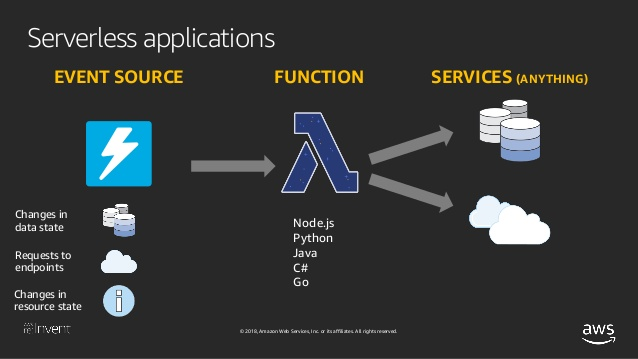

# AWS serverless(서버리스)

---
### 서버리스 아키텍쳐 란?
서버리스(Serverless)는 직역하면 "__서버가 없다__"라는 뜻이 된다. 
하지만 정말로 서버가 없는 것을 뜻하는게 아니다.  서비스를 하는데 있어 어찌되었든 저장소는 필요하고 서버는 필요하기 때문이다. 
따라서 정확히 말하자면, 서버리스는 서버가 없는 백엔드 라는 뜻이 아닌 <ins>*우리가 직접 서버를 관리하지 않아 신경 쓸 필요없는 경우*<ins>를 뜻한다.

---
### Function 내부 구조

> Event Source -> Function -> Service

Event Source: 함수가 실행될 조건이자 이벤트 소스 (HTTP 요청, 메시징, Cron 등) 
Function: 작업할 내용 
Service: 작업 결과를 처리(DB 저장, 다른 서비스로 전달, 메시징, 출력 등)
---
### 장점
1. __운영 비용 절감__ 
   * 서버를 최대 트래픽에 대비하여 구매하면 대부분의 시간을 유휴 상태로 보내게 된다. 
   * 서버리스에서는 트래픽 대비하여 비용을 지불하므로 비용적 측면에서 이득이다.
2. __유동적인 자원 사용(Auto Scaling)__ 
    * 수요에 맞게 자동으로 공급을 조절하므로 예기치 못한 트래픽에 대한 걱정도 덜 수 있다.
3. __서버 유지보수가 필요없다__ 
    * 서버리스는 서버를 관리할 필요가 없다. 서버의 운영체제, 네트워크, 보안, 스토리지, 백업 등을 신경쓸 필요가 없다.
### 단점
1. __공급업체에 대한 의존성__ 
    * 예를들어 AWS 사용자라면 Amazon에 의지하게 된다. 또한 BaaS 서비스를 사용하게 될 경우 더욱 의존성이 커진다 
    * 아마존에 문제생기면 전세계 난리나겠다.
2. __보안 이슈__ 
    * 데이터를 사내에서 직접 관리하는것이 아니기 때문에 민감한 데이터에 관해서는 우려가 생긴다 
3. __느릴수 있다.__ 
    * 이 이슈는 사실 아직까지는 트래픽이 적은 초기 스타트업은 걱정하지 않아도될 행복한 고민이다. 
    * Lambda의 __ColdStart__ 에 대한 이슈 
    -> <ins>ColdStart란?<ins> 
    * Lambda를 오랫동안 사용하지 않고 있다가 오랜만에 실행하게 되면 딜레이가 발생한다. 
    -> <ins>발생하는 이유?<ins> 

      * 처음의 비유처럼 람다는 항상 나를 주시하고 기다리고 있는게 아니다. 
      * 실행환경을 구성하고 코드를 실행하는데 시간이 걸리는 것이다.(이는 효율적인 사용을 위해 오랫동안 사용하지 않을경우 컴퓨팅 파워를 꺼두기 때문) 
      -> <ins>해결방법?<ins> 
    
        * 람다를 지속적으로 호출해주거나, 람다의 메모리를 늘리거나, 비용을 지불하고 프로비저닝 옵션을 활성화 해두거나하는것으로 해결을 해야하는데 어찌 되었든 리소스가 추가로 들어가게 된다.
        장점이 더커서 사용하기로 결정했지만 단점도 알아둬야 추후 알맞게 대응할 수 있다!

---

### DynamoDB 연동 
1. https://console.aws.amazon.com/dynamodb/home
2. 테이블 만들기 버튼 
3. 테이블 이름: User 
4. 기본키(Primary Key): id 입력, 번호(Number) 선택 
5. 생성 버튼 
6. 항목 탭 선택 
7. 항목 만들기 버튼 
8. Append 또는 Insert 통해 필드:값 형태로 입력 
9. 저장 버튼 
---

### 일반적인 웹 애플리케이션을 서버리스 형태로 구성한 아키텍처
* 사용자에게 보여줄 웹 페이지 및 정적 콘텐츠는 S3 에 저장 후 호스팅
* 사용자 요청은 API Gateway 로 받기
* 처리할 내용은 Lambda 에 작성
* 데이터 저장은 DB 서비스(DynamoDB) 사용
* 사용자 인증은 JWT(Amazon Cognito) 사용
* Route 53으로 도메인 구입 및 제공(선택사항)

---
### 내가 공부한대로 이해하기 쉽게 적은 README.md
* [README2.md](./README2.md)

