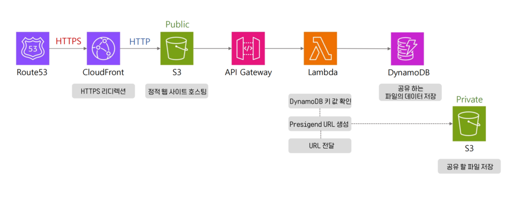
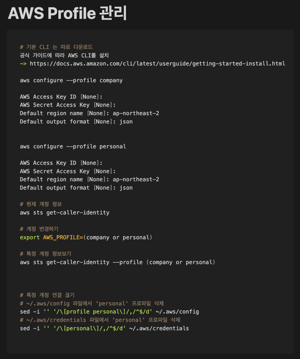

# 내가 이해하여 만든 서버리스 아키텍쳐

---
### 서버리스 프레임워크를 사용하면서 불편했던 점
1. 초기에는 AWS Console을 사용하여 Lambda 함수를 만들어야하는 불편함
   1. 코드가 길어지면서 코드를 수정하고 테스트하는데 번거로움을 느낌
   2. console에서 코드를 직접 입력하고, 라이브러리 install 하면 용량에 제한이 큼
2. intelliJ, Vscode 등의 tool을 이용해도 MSA화 하기에는 불편함을 느낌(서비스별 분리 가능할지)
3. Lamda 함수를 만들 때마다 serverless.yml을 작성해야 하는 번거로움
4. DynamoDB, S3, API Gateway 등을 연동할 때마다 AWS Console에서 설정해야 하는 번거로움
5. 배포 및 테스트를 위해 AWS CLI를 사용해야 하는 번거로움
6. 서버리스에 대한 학습이 필요함
   1. 서버리스에 대한 학습 자료가 부족함
7. DynamoDB 사용에 대한 어려움(쿼리가 정말 익숙 하지 않음)
8. 스웨거 연동이 안됨

---
### 내가 이해한 토대로 서버리스 아키텍쳐 구축 방법
 
### 아키텍처 동작 과정
1. DNS 요청 및 HTTPS 리디렉션(Front):
   * 사용자가 웹 브라우저에서 도메인을 입력하면 Route 53이 요청을 CloudFront로 전달.
   * HTTPS 인증을 통해 보안 통신을 유지.
2. 정적 웹 콘텐츠 제공((Front)):
   * CloudFront는 엣지 서버에 캐싱된 콘텐츠를 제공하거나 S3 Public 버킷에서 정적 파일을 가져옴.
3. API 요청 처리(Back):
   * 클라이언트가 동적 데이터 요청(API 호출)을 보내면, 요청은 API Gateway를 통해 Lambda로 전달.
   * API Gateway는 인증, 데이터 변환, 트래픽 제어 등을 수행.
4. Lambda의 Presigned URL 생성(Back):
   * Lambda는 DynamoDB에서 메타데이터를 확인하고, Private S3에 접근할 Presigned URL을 생성.
   * 이 URL은 제한된 시간 동안 유효하며, 이를 통해 클라이언트가 파일을 업로드 또는 다운로드.
5. 데이터 저장 및 전송(Back):
   * 클라이언트가 Presigned URL을 통해 Private S3에 파일을 저장.
   * 관련 메타데이터는 DynamoDB에 저장되어 이후 데이터 접근을 관리.
> (Backend 기준 API 요청시)::: *S3 bucket와 DynamoTable을 사전 생성되어있어야함.* 
> -> 배포된 서비스 데이터가 저장된 S3로 호스팅이 되어 해당 api 정보를 찾는다 
> -> 해당 api 정보를 API Gateway를 통해 Lambda로 전달한다 
> -> 전달받은 Lamda에서 해당 함수를 실행하여 필요한 데이터들에 대한 기능을 DynamoDB에 요청한다. 
> -> DynamoDB에서 데이터를 가져와서 Lambda에서 처리한 후 결과를 반환한다. 
> -> 결과를 API Gateway를 통해 클라이언트에게 전달한다. 
> -> (공유할 파일이 있다면 특정 S3에 저장 및 조회 기능을 수행 한다.): 여기에서 배포된 서비스 데이터가 저장된 S3와 다름 
> -> 클라이언트는 받은 결과를 화면에 렌더링한다.
---
### 프레임워크 구현 방법
* __MSA 화 시키기__
  * 서비스별로 분리하여 개발 
     * 해당 프로젝트는 단일 서비스로 구성되어 있지만 공통 serverless.yml을 사용하여 MSA화 가능(타 프로젝트 진행)
  * AWS CLI 접속 하여 배포 간편화
     * 현 프로젝트는 단일 서비스라 배포시 프로젝트 내 모든 기능이 배포가 되지만, 서비스 분리시, 서비스 별 배포 가능(타 프로젝트 진행)
     * 배포 스크립트 작성
       * 디렉토리: /scripts/*
* DynamoDB 쿼리 공통화
  * 서비스별로 다른 쿼리를 사용하지 않도록 공통 쿼리를 사용하여 개발
    * 디렉토리: /common/dynamodb/* 

---
### 프로젝트 환경

