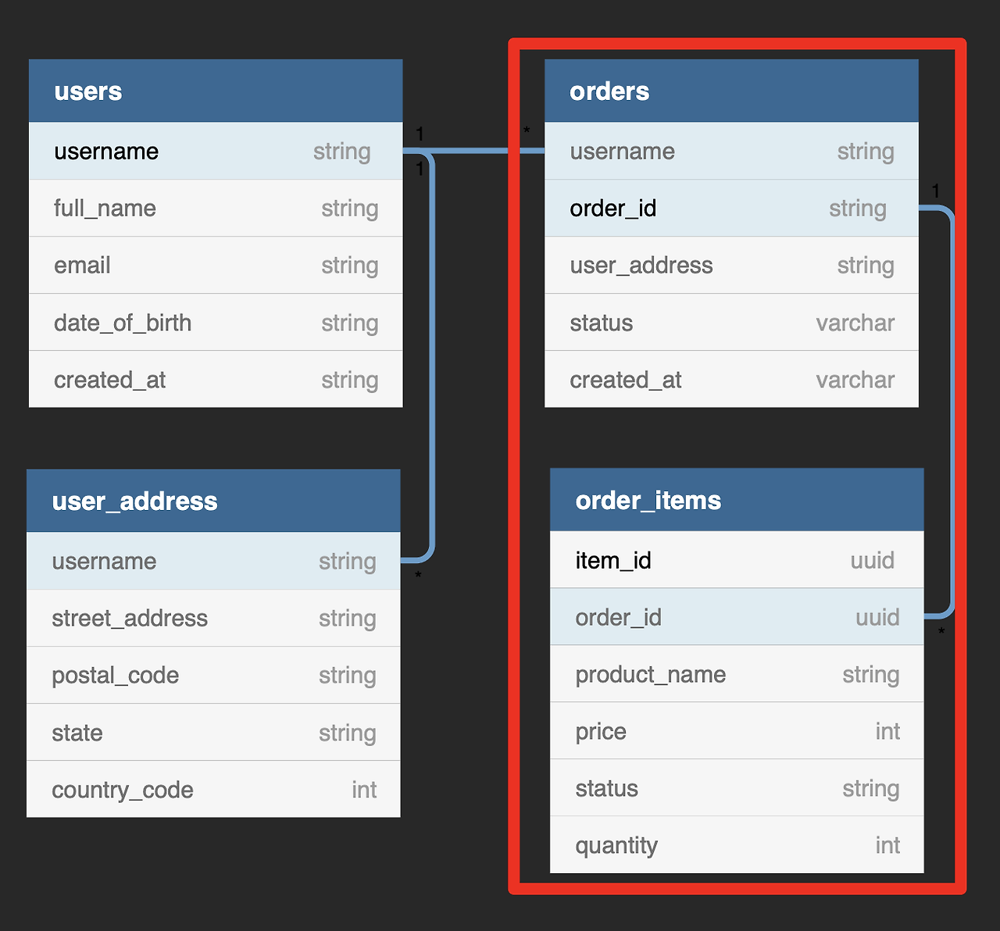

# 내가 이해하여 만든 DynamoDB 디자인 패턴

---
### 가장중요!! <ins>*다이나모 디자인 패턴에는 답이 없음*<ins>

---
### DynamoDB란?

* Join에 취약한 NoSQL 데이터 베이스 이므로 웬만한 데이터 내용은 통째로 넣어야함
  * 단점: 데이터 수정 및 삭제시에 해당 데이터가 속해있는 데이터들을 모두 찾아서 수정 및 삭제를 해줘야함
  * 단점: 데이터를 통째로 넣어야 하므로 데이터가 많아지면 데이터베이스 용량이 늘어남
* SK 로만 조건 검색 불가능
  * 해결방법: GSI를 사용하여 SK로만 검색 가능
---
### 예시
* SQL version
    
     

* NoSQL(DynamoDB) version

---

---

### 해당 프로젝트에서 사용중인 DynamoDB 테이블 구조
   | Name    | Attribute | PK           | SK                     | createdAt     | title    | name     | email           | content  | description       | password     | birth      | user                                              | updatedAt     |     
   |---------|-----------|--------------|------------------------|---------------|----------|----------|-----------------|----------|-------------------|--------------|------------|---------------------------------------------------|---------------|
   | **게시판** | *Type*    | `String`     | `String`               | `number`      | `String` |          |                 | `String` | `String`          |              |            | JSON                                              | `number`      |
   |         | *Example* | BOARD        | BOARD#{uuid}           | 1735191752000 | 게시글1     |          |                 | 게시글 내용   | test decscription |              |            | {PK: "USER", "SK": "USER#{uuid} or {email} ...}"} | 1735191752000 |
   | **답글**  | *Type*    | `String`     | `String`               | `number`      |          |          |                 | `String` |                   |              |            | JSON                                              | `number`      |
   |         | *Example* | BOARD#{uuid} | COMMENT#{uuid}         | 1735191752000 |          |          |                 | 댓글 내용    |                   |              |            | {PK: "USER", "SK": "USER#{uuid} or {email} ...}"} | 1735191752000 |
   | **유저**  | *Type*    | `String`     | `String`               | `number`      |          | `String` |                 | `String  |                   | `String`     | `String`   |                                                   | `number`      |
   |         | *Example* | USER         | USER#{uuid} or {email} | 1735191752000 |          | 홍길동      | test@test.co.kr |          |                   | #sf13$153^&u | 2000-01-01 |                                                   | 1735191752000 |

