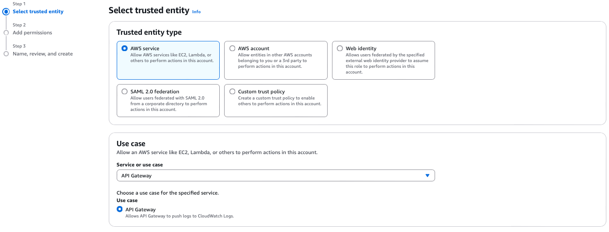
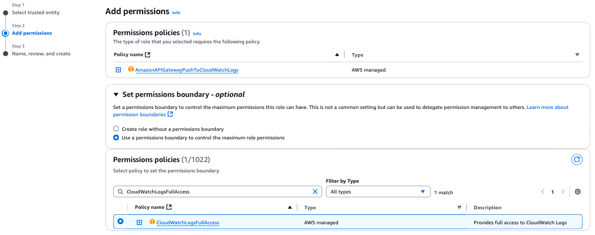
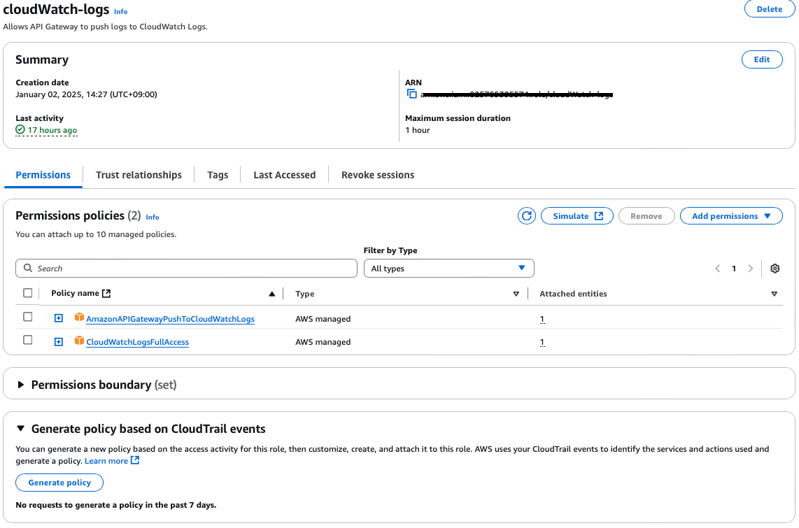
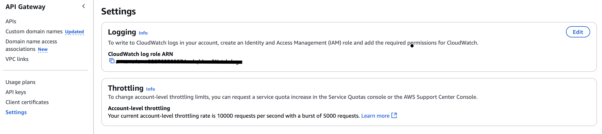
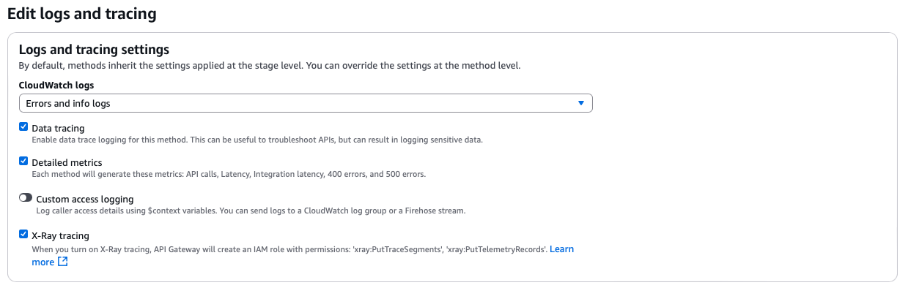
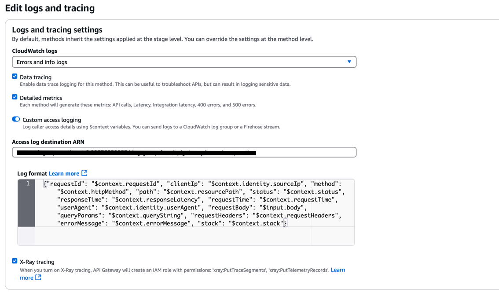
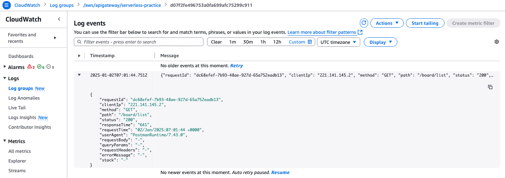
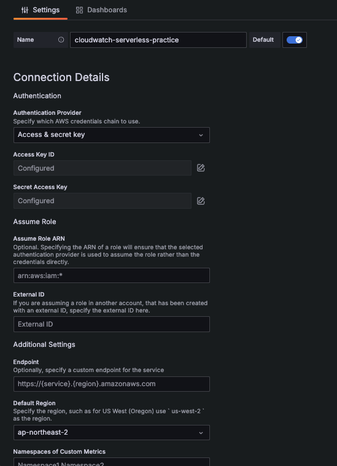
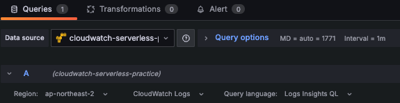
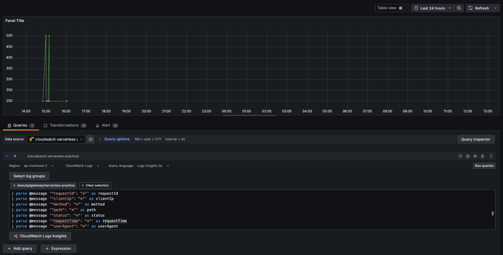

# API Gateway + Grafana 연동

---
## AWS API Gateway로 함수들 CloudWatch 로그 모니터링 통합
1. __CloudWatch Logs Role 생성__
   1. CloudWatch Logs에 접근할 수 있는 IAM 역할을 생성해야 합니다.
   2. IAM 콘솔에 접속하고, Roles로 이동합니다.
   3. Create Role을 클릭하여 API Gateway에서 사용할 역할을 생성합니다.
   4. AWS Service를 선택하고 API Gateway를 선택한 후, Next: Permissions를 클릭합니다.<br>
      <br>
   5. CloudWatchLogsFullAccess 정책을 선택하여 API Gateway가 로그를 작성할 수 있도록 합니다. 다른 정책을 추가할 수도 있습니다.<br>
      <br>
   6. Review에서 역할 이름을 설정하고 Create role을 클릭하여 역할을 생성합니다.<br>
      <br><br>
2. __API Gateway 계정 설정에서 CloudWatch Logs Role ARN 설정__
   1. API Gateway 콘솔에 접속한 후 왼쪽 메뉴에서 Settings를 클릭합니다.
   2. Edit logging settings 필드를 찾습니다.
   3. CloudWatch Logs Role ARN 필드에 생성한 IAM 역할 ARN을 입력합니다.
      1. 예시 ARN: arn:aws:iam::825765395574:role/cloudWatch-logs<br>
   <br><br>
3. __API Gateway에 CloudWatch Logs Role ARN 설정__
   1. API Gateway 콘솔에 접속하고, 로그를 설정할 API Stage를 선택합니다.
   2. Stage Editor에서 Logs and tracing 탭으로 이동하여 edit 버튼을 선택합니다.
   3. CloudWatch Logs 섹션에서 Errors and info logs 를 선택합니다.
   4. 남은 Data trace, Detailed metrics, X-Ray tracing 설정을 마치고 Save changes를 클릭하여 변경사항을 저장합니다.<br>
      <br><br>
4. __(선택사항) Cloud Watch 로그 사용자화__
   * Cloud Watch 로그 그룹명은 자동으로 만들어지므로, 특정 로그 그룹명을 지정하고, 로그 스트림을 사용자화할 수 있습니다.
   1. Cloud Watch에서 신규 로그 그룹을 원하는 그룹명으로 생성한 후, 해당 Cloud Watch 로그 그룹 ARN을 확인합니다.
   2. API Gateway 콘솔에 접속하고, 로그를 설정할 API Stage를 선택합니다.
   3. Stage Editor에서 Logs and tracing 탭으로 이동하여 edit 버튼을 선택합니다.
   4. Custom access logging을 활성화 후, 1에서 생성한 Cloud Watch 로그 그룹 ARN을 Access log destination ARN에 입력합니다.
   5. (추가사항) 로그 포맷을 맞춰야한다면 원하는 포맷으로 띄워쓰기 없이!! Log format에 입력합니다.
      * 예시
        ```json
        {"requestId": "$context.requestId", "clientIp": "$context.identity.sourceIp", "method": "$context.httpMethod", "path": "$context.resourcePath", "status": "$context.status", "responseTime": "$context.responseLatency", "requestTime": "$context.requestTime", "userAgent": "$context.identity.userAgent", "requestBody": "$input.body", "queryParams": "$context.queryString", "requestHeaders": "$context.requestHeaders", "errorMessage": "$context.errorMessage", "stack": "$context.stack"}
        ```
      <br><br>
   ### 최종 결과 화면
   <br><br>

---
### 그 외 참고 사항
   * 위의 방법 말고 해당 프로젝트 내의 함수들 실행때마다 로그 그룹을 생성하고, 로그 스트림을 사용자화할 수 있습니다.
     * 이 방법은 함수 실행시마다 로그 그룹이 생성되므로, 로그 그룹을 생성할 때마다 로그 그룹명을 변경해야합니다.
       * commons/lambda/cloud-watch.ts 파일 참고
--- 

---
## 그라파나 세팅
1. 그라파나 설치
    ```bash
   brew install grafana
   brew services start grafana
   sudo find / -name grafana.ini
   3. 외부 접속 허용 설정
    sudo vi /opt/homebrew/etc/grafana/grafana.ini
      1. http_addr 설정: http_addr를 0.0.0.0으로 변경하면, 외부에서 접속할 수 있게 됩니다.
      http_addr = 0.0.0.0
      2. http_port 설정: 기본 포트는 3000이지만, 만약 다른 포트를 사용하려면 이 값을 수정할 수 있습니다.
      http_port = 3000
   
   brew services restart grafana
   ifconfig   # IP 확인
   http://{IP 주소}:3000/login 접속(ID: admin, PW: admin)
   http://172.16.20.139:3000/login
    ```
2. 그라파나 대시보드 작성
   1. CloudWatch 데이터 소스 추가
      * AWS CloudWatch Logs를 Grafana에서 사용할 수 있도록 데이터 소스를 추가하는 과정입니다.
   2. CloudWatch 로그 그룹 선택
      * 데이터 소스가 추가되면, 이제 CloudWatch 로그를 선택하고 해당 로그를 쿼리할 수 있습니다.
   3. CloudWatch 데이터 소스 구성
      * Name: 데이터 소스 이름을 설정합니다. (예: AWS CloudWatch 또는 원하는 이름)
      * Default: 기본 데이터 소스로 사용하려면 이 항목을 체크합니다.
      * Region: CloudWatch 로그를 사용할 AWS 리전을 선택합니다. 예를 들어, ap-northeast-2 (서울 리전).
      * 인증 방법 설정:
        * Access & Secret Key: AWS IAM 사용자에게 할당된 Access Key ID와 Secret Access Key를 입력합니다.
        * Assume Role: AWS IAM 역할을 사용하여 CloudWatch에 접근하려면 역할 ARN을 설정할 수 있습니다.
      * "Save & Test" 버튼을 클릭하여 연결을 테스트합니다. 연결이 성공적으로 완료되면 "Data source is working" 메시지가 표시됩니다.<br>
        <br><br>
   4. CloudWatch 로그 그룹 선택
      * 대시보드 생성:
        * 왼쪽 사이드바에서 "+" 아이콘을 클릭하고 **"Dashboard"**를 선택합니다.
        * Add Query를 클릭하여 새 쿼리를 추가합니다.
      * CloudWatch Logs 선택:
        * 쿼리 창에서 CloudWatch를 선택합니다.
      * Log Group 항목에서 모니터링할 로그 그룹을 선택합니다. 예를 들어, API Gateway 로그 그룹인 "/aws/apigateway/serverless-practice"를 선택합니다.<br>
        <br><br>
      * 쿼리 작성:
        * Log Stream을 선택하여 특정 스트림을 필터링하거나, 모든 로그를 조회할 수 있습니다.
        * 로그를 필터링하고 원하는 데이터만 추출할 수 있도록 CloudWatch Logs Insights 쿼리를 작성합니다.<br>
          ```bash
          # 예시 쿼리 1:
          fields @timestamp, @message
          | filter status == "500"
          | sort @timestamp desc
          | limit 20
          #  위 쿼리는 status가 500인 로그 메시지를 최근 20개까지 출력합니다.
          ```
          ```bash
          # 예시 쿼리 2:
          fields @timestamp, @message
          | parse @message '"requestId": "*"' as requestId
          | parse @message '"clientIp": "*"' as clientIp
          | parse @message '"method": "*"' as method
          | parse @message '"path": "*"' as path
          | parse @message '"status": "*"' as status
          | parse @message '"requestTime": "*"' as requestTime
          | parse @message '"userAgent": "*"' as userAgent
          | sort @timestamp desc
          | limit 20
          #  위 쿼리는 모든 로그 메시지를 최근 20개까지 출력합니다.
          ```

   ### 최종 결과 화면
   <br><br>
---
### 그 외 참고 사항
* CloudWatch Logs Insights 쿼리를 사용하여 로그를 필터링하고, 원하는 데이터만 추출할 수 있습니다.
  * CloudWatch Logs Insights 쿼리 문법은 SQL과 유사하며, 필드를 선택하고 필터링하여 로그를 조회할 수 있습니다.
  * 쿼리 결과를 시각화하여 로그를 모니터링할 수 있습니다.
* 필요에 따라 대시보드에 여러 패널을 추가하여 다양한 메트릭을 시각화할 수 있습니다.
  * 예를 들어, HTTP 요청 상태 코드별로 발생한 에러를 시각화할 수 있습니다.
* Grafana 알림 기능을 설정하여 특정 조건을 충족하는 로그가 발생하면 알림을 받을 수 있습니다.
  * 예를 들어, 특정 상태 코드가 발생하면 알림을 받도록 설정할 수 있습니다.
---
