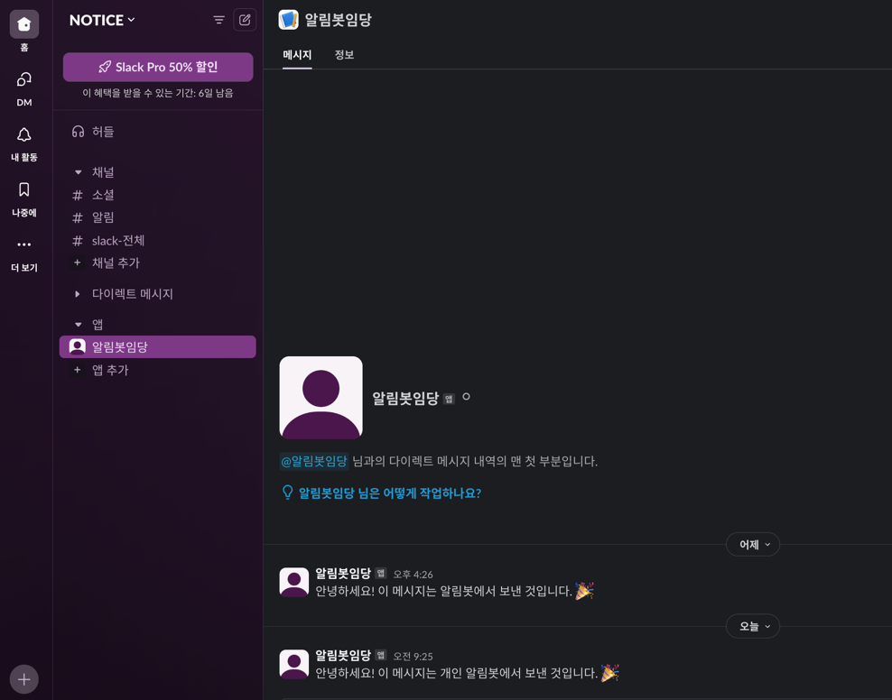
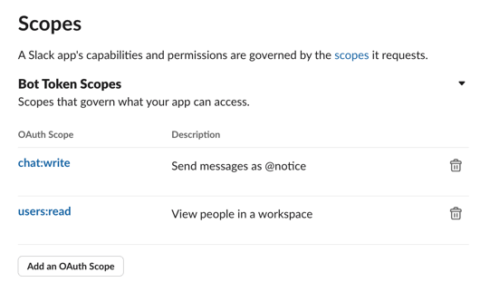
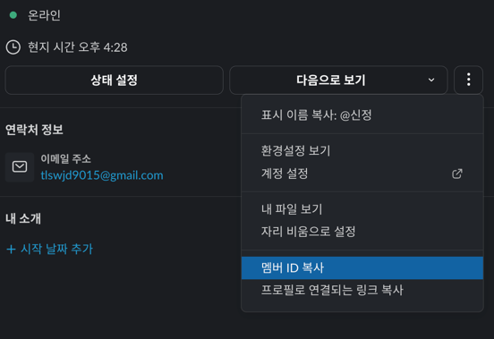

# Slack 알림 보내기

---
## 사전 세팅
- 해당 기능을 위해 임의로 슬랙 워크스페이스 생성함 
   
###  1. Slack App 설정
1. Slack App 생성 
    - Slack API: Your Apps로 이동. 
        - https://api.slack.com/apps
    - "Create New App" → "From Scratch" 선택 후 앱 이름과 워크스페이스 지정.
2. OAuth & Permissions 설정 
    - OAuth & Permissions 메뉴로 이동.
    - Scopes 추가:
        - 아래 Scopes를 추가합니다:
            - chat:write: 메시지 전송 권한.
            - users:read: 사용자 정보 조회 권한(필요 시). 
               
    - "Install to Workspace" 버튼 클릭 → 권한 요청 승인 → Bot User OAuth Token 복사.
    - 환경변수에 입력
3. User ID 확인
    - Slack 워크스페이스에서 사용자 프로필을 클릭하여 ID를 확인합니다. 
       
    - 환경 변수에 입력
4. Channel Id 확인
    - 생성한 App에서 해당 ID를 확인합니다.
      

###  2. AWS Lambda 함수 구현
